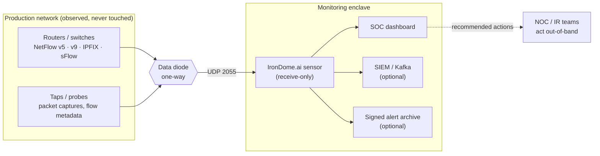
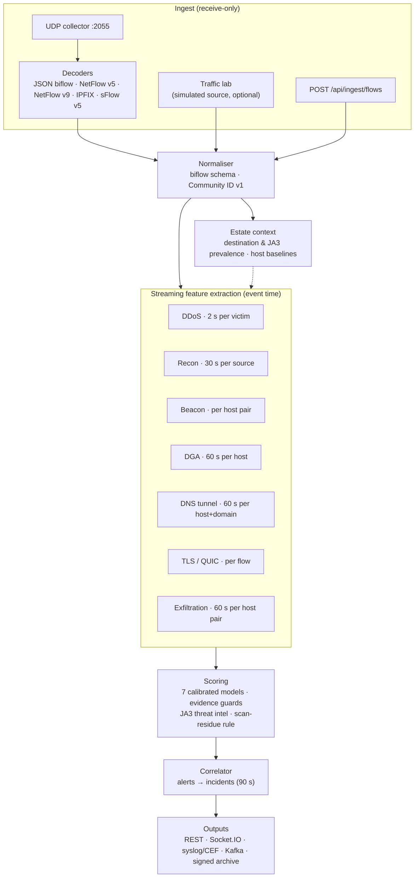
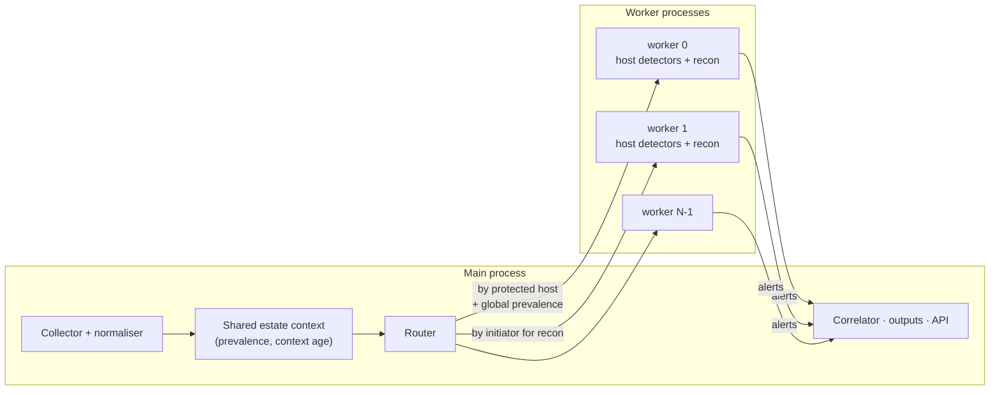
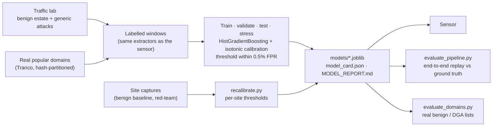
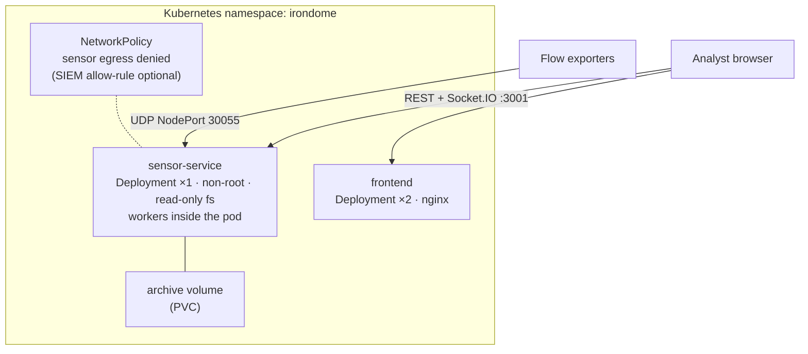

# IronDome.ai architecture

IronDome.ai is a passive, receive-only sensor for networks monitored through a data diode
(SIH PS 26145, NTRO). It ingests one-way flow and packet metadata, extracts streaming
features, scores them with calibrated models and emits standard, evidence-backed alerts.
It never sends anything back into the network it watches.

## 1. System context

Everything to the right of the diode is analysis. Alert outputs (dashboard, SIEM, archive)
stay inside the enclave. Mitigation is done by people on the production side, out of
band. The sensor has no endpoint that could block, isolate or rate-limit anything.

## 2. Inside the sensor

| Stage | Where | Notes |
|---|---|---|
| Decoders | `irondome/netflow.py`, `irondome/ipfix.py`, `irondome/sflow.py`, sensor collector | IPFIX / v9 templates cached per exporter; RFC 5103 reverse elements fill the responder side; sFlow packet samples are rebuilt into flows and scaled by the sampling rate |
| Normaliser | `irondome/schema.py` | validates and coerces every record into one biflow format; no payload field exists |
| Features | `irondome/features.py` | seven extractors with event-time windows, a watermark (1 s live lag) and a 30 s late-data horizon: older records only update estate context, so a backlog can't fake a spike |
| Scoring | `irondome/scoring.py` | per-detector model + threshold; guards reject techniques the evidence can't support, hold prevalence-based alerts during the 5-minute learning period, gate encrypted-traffic alerts on two signals, and drop SYN-flood windows that are really a scan seen from the target |
| Correlation | `irondome/correlate.py` | one incident per (threat class, entity) within 90 s; occurrences, first/last seen, max confidence |
| Outputs | `irondome/outputs.py`, sensor API | dashboard (REST + Socket.IO), syslog RFC 5424 with CEF or JSON, Kafka, hash-chained HMAC-signed JSONL archive |

### Which inputs feed which detectors

| Input | (a) DDoS | (b) C2 beacon | (c) DGA / DNS tunnel | (d) Encrypted malware | (e) Recon | (f) Exfiltration |
|---|:-:|:-:|:-:|:-:|:-:|:-:|
| PCAP / PCAPNG replay | ✅ | ✅ | ✅ | ✅ | ✅ | ✅ |
| JSON biflow records (probe metadata) | ✅ | ✅ | ✅ | ✅ | ✅ | ✅ |
| IPFIX (with RFC 5103 biflows) | ✅ | ✅ | – | – | ✅ | ✅ |
| NetFlow v5 / v9 | ✅ | ✅ | – | – | ✅ | ✅ (one direction per record) |
| sFlow v5 (sampled) | ✅ | limited | only if a sampled packet holds the query | only if it holds the ClientHello | ✅ | ✅ |

Standard NetFlow/IPFIX/sFlow carry no DNS names or TLS handshakes, so classes (c) and (d)
need packet captures or a probe that exports the JSON metadata format.

## 3. Scale-out across processes

One process sustains about 5,000 flows/s. With `IRONDOME_WORKERS=N` the sensor splits work:

- **Partitioning.** Host-centred detectors (DDoS victim, beaconing, DGA, DNS tunnelling, TLS, exfiltration) get
  the flows of the internal hosts a worker owns. Scan detection gets flows by *initiator*, so a sweep
  across many hosts still lands in one worker. A flow reaches at most two workers.
- **Shared estate context.** Prevalence counts span all hosts, so only the main process can compute it. Every
  routed flow carries the current global values and the estate's context age.
- **Cross-worker rules.** The SYN-flood/scan rule runs again in the main process, because the scanner may have
  been flagged by a different worker than the one watching the target.
- **Back-pressure.** Bounded queues; a worker that falls behind has whole batches shed and counted.

## 4. Machine-learning lifecycle

Models are trained on exactly the feature vectors the sensor computes (`irondome/samples.py` drives the
same extractors). The DGA model's benign side and its lexical statistics (character bigrams, vocabulary,
suffix rarity in `irondome/lexical_model.json`) come from the real Tranco list. Deployments re-calibrate
thresholds on their own traffic with `model_microservice/recalibrate.py`.

## 5. Deployment

The same two images run with Docker Compose (`docker compose up`). See [`k8s/KUBERNETES.md`](k8s/KUBERNETES.md).

## 6. Data contracts

- **Flow record** (`irondome/schema.py`): `ts, te, src/dst ip+port, proto, pkts/bytes fwd+bwd, flags fwd/bwd, seg`
  plus optional `dns`, `tls` (JA3/JA3S/JA4, SNI, ALPN), `quic`, `splt` (packet sizes/timing). No payload.
- **Alert record** (`GET /api/schema/alert`): `timestamp`, `flow_id` (Community ID), `threat_class`, `ps_ref`,
  `technique`, `mitre_attack`, `confidence`, `severity`, `evidence` (feature values, deviations from the benign
  baseline, context), `detector`, `recommended_action`.

## 7. Security posture

- Receive-only collector (tested: it keeps no send handle and never replies); no mitigation API (tested).
- In Kubernetes: non-root, read-only root filesystem, all capabilities dropped, egress denied.
- No decryption and no payload anywhere in the data model.
- Lab ground truth is stripped before export, so the sensor never sees the answers (tested).
- Alert archive: SHA-256 hash chain + HMAC-SHA256 per record; `scripts/verify_archive.py` pinpoints any edit,
  deletion or reordering.

## 8. Known limits

- All attack traffic used for training is synthetic (the lab's generic generators). Real benign domains are
  used for DGA. Real-world recall should be measured on captures of real tools (hping3, nmap, dnscat2, iodine)
  replayed with `scripts/replay_capture.py`, and on labelled DGA lists with `evaluate_domains.py`.
- Lexical DGA detection cannot separate dictionary-word DGAs from real brand names one domain at a time. The
  sensor catches them through NXDOMAIN behaviour across a host's lookups instead.
- Scale-out is process-level on one machine; multi-machine sharding would need the estate context in a
  shared store.
