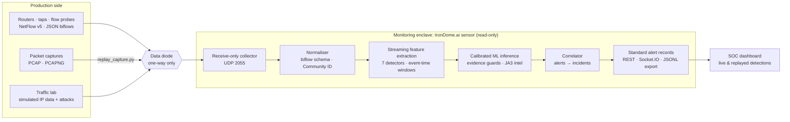

<div align="center">

# 🛡️ IronDome.ai

### AI-based detection of cyber threats in unidirectional IP traffic

**Smart India Hackathon · Problem Statement 26145 · National Technical Research Organisation (NTRO)**

<p>
  
  
  
</p>
<p>
  
  
  
  
  
  
</p>

**IronDome.ai is a passive, receive-only threat-detection sensor for networks monitored through a data diode.**
It reads one-way packet and flow metadata, extracts streaming behavioural features, scores them with calibrated
machine-learning models and raises standardised, evidence-backed alerts on a live SOC dashboard within seconds.
It never decrypts a payload and never sends a single packet back.

[Highlights](#-highlights) · [How it works](#%EF%B8%8F-how-it-works) · [PS compliance](#-problem-statement-compliance) · [Results](#-results) · [Dashboard](#%EF%B8%8F-dashboard) · [Quick start](#-quick-start) · [Demo guide](#-demo-guide-for-evaluators)


<sub>Live sensor, not a mock-up: incidents from a full kill chain, a UDP amplification attack and SYN floods that the built-in traffic lab injected into a 48-workstation estate.</sub>

</div>

---

## ✨ Highlights

| | |
|:--|:--|
| 🎯 **6 / 6 PS threat classes** | DDoS · C2 beaconing · DGA & DNS tunnelling · malware in encrypted sessions · reconnaissance · data exfiltration, covering **13 attack techniques** mapped to MITRE ATT&CK |
| 🧠 **7 calibrated ML detectors** | 124 behavioural features, gradient-boosted models with isotonic calibration, so a confidence of 0.9 means about 90% |
| ✅ **36 / 36 attack runs detected** | 12 attack scenarios × 3 independent replays through the streaming pipeline, scored against ground truth |
| ⚡ **Detects in seconds** | median time-to-detect 1.1 s for scans and DNS tunnels, 2 s for floods (C2 beacons take 36 s because they need several check-ins) |
| 🔇 **~4 false incidents per hour** | on a busy 48-workstation benign estate (109,279 flows) |
| 🚀 **5,000 flows/s per process** | 0.00% loss, p95 alert latency 2.66 s, ≈ 1 Gbps of monitored traffic, measured on a single Windows 11 machine |
| 🔒 **Zero return path, zero decryption** | receive-only collector and no mitigation endpoints (both proven by automated tests), plus egress denied at the cluster; encrypted traffic is judged from metadata only |

---

## 🎯 The problem

Critical-infrastructure networks are increasingly monitored through **one-way links (data diodes)**: traffic flows *into* the
monitoring enclave, and nothing can ever flow back. The analysis side can only listen. It cannot complete a handshake,
query the source or block anything inline. Most of that traffic is encrypted, and signature-based tools miss novel attacks.

PS 26145 asks for an AI/ML pipeline that ingests this one-directional traffic (packet captures, flow records and derived
metadata), **detects, classifies and scores** six classes of threats in near real time, and outputs **labelled alerts with
confidence and supporting evidence**, while keeping ingest read-only, never decrypting payloads, streaming with bounded
latency, meeting a stated throughput target and using a standard alert schema.

## 💡 Our solution

IronDome.ai does exactly that, end to end:

- **One-way ingest.** A receive-only UDP collector accepts NetFlow v5 datagrams and JSON bidirectional flow records.
  PCAP/PCAPNG captures are parsed read-only into the same flow format and replayed through the same one-way path.
- **Streaming feature engine.** Seven detectors compute 124 behavioural features in event-time windows with watermarks
  and a late-data policy. Flows are processed as they arrive; nothing waits for a batch.
- **Calibrated ML inference.** One model per detector, with thresholds chosen inside a 0.5% false-positive budget,
  evidence-consistency guards and JA3 threat-intel enrichment.
- **Standard, explainable alerts.** Every alert carries a Community ID flow identifier, threat class, technique, calibrated
  confidence, severity, MITRE ATT&CK IDs and the features that deviate most from the benign baseline. Related alerts are
  correlated into incidents.
- **SOC dashboard.** Live and replayed detections with severity, confidence, evidence, a timeline, model cards and a
  live PS-compliance view.
- **Traffic lab.** Generates the PS's "simulated IP data": a realistic benign estate plus every attack in the PS's
  dataset guidance, with ground truth for evaluation and optional PCAP output that opens in Wireshark.

---

## 🏗️ How it works



**Life of a flow record**

1. **Ingest.** A datagram arrives on UDP 2055. The collector decodes it and never replies; it does not even keep a handle
   it could send with.
2. **Normalise.** Each record is validated into a bidirectional flow ("biflow", modelled on IPFIX RFC 5103) and given a
   Community ID v1 hash, so alerts can be joined with Zeek or Suricata logs.
3. **Extract.** The record is routed to all seven streaming extractors. Each window closes when the event-time watermark
   passes it (1 s live lag). Records older than the 30 s late horizon only update estate context (destination and JA3
   prevalence, per-host baselines), so a backlog can never fake a spike.
4. **Infer.** Each candidate window is scored by its calibrated model. The alert must clear the detector's threshold and
   pass guard rules: the named technique must be supported by the evidence, and prevalence-based detectors alert only on
   overwhelming evidence during a 5-minute baseline-learning period (the live sensor warm-starts from recent history).
5. **Output.** The alert is built to the standard schema, correlated into an incident (90 s window) and pushed to the
   dashboard. p95 latency from last contributing flow to alert is **≈ 1 s** at demo load and **2.66 s** at 5,000 flows/s.

---

## ✅ Problem-statement compliance

### Expected outcomes

| | PS asks for | IronDome.ai delivers | Where |
|:-:|---|---|---|
| ✅ | Working prototype: ingest, feature extraction, model inference, alert output | Streaming sensor with all four stages, running live or on replayed captures | [`backend/sensor-service/`](backend/sensor-service/), [`irondome/`](irondome/) |
| ✅ | Documentation of models, features, training and validation | Per-model cards (algorithm, features, importance, calibration), held-out and shifted-distribution results, end-to-end evaluation | [`docs/MODEL_REPORT.md`](docs/MODEL_REPORT.md), [`docs/EVAL_REPORT.md`](docs/EVAL_REPORT.md), [ML pipeline](#-ml-pipeline--validation) |
| ✅ | Dashboard of live or replayed detections with severity and confidence | React SOC dashboard: incidents, threat matrix, flow explorer, timeline, models, compliance | [`frontend/`](frontend/) |

### Threat classes

| | PS class | Techniques detected | Key signals |
|:-:|---|---|---|
| ✅ | **(a)** Volumetric / protocol DDoS | SYN flood · UDP/ICMP flood · UDP reflection/amplification · spoofed-source flood · Slowloris | flow and packet rates, **source-IP entropy**, half-open (SYN-only) ratio, unanswered ratio, amplification-port share, slow-connection share |
| ✅ | **(b)** Botnet C2 beaconing | periodic beacon (with jitter) | **inter-arrival periodicity** (CV, MAD, regularity), payload-size stability, destination prevalence |
| ✅ | **(c)** DGA domains & DNS tunnelling | DGA · DNS tunnelling | **character entropy, bigram language model**, dictionary coverage, TLD rarity; **query length**, uniqueness, **record-type anomalies** (TXT/NULL/CNAME), response size |
| ✅ | **(d)** Malware in encrypted sessions | watch-listed TLS fingerprint · anomalous TLS behaviour | **JA3 / JA3S / JA4**, fingerprint and destination prevalence, SNI/ALPN, **packet-size and timing sequences**. Metadata only, never decrypted |
| ✅ | **(e)** Reconnaissance & port scanning | vertical port scan · horizontal host sweep | **fan-out** (ports per host, hosts per port), failed and no-payload ratios, port contiguity |
| ✅ | **(f)** Data exfiltration | asymmetric outbound transfer | **out/in byte ratio**, outbound volume vs the host's own baseline, destination prevalence, port class |

### Constraints

| | PS constraint | How it is met | Proof |
|:-:|---|---|---|
| ✅ | **(a)** Read-only ingest, no return path, live query or inline block | Receive-only UDP collector that never holds a send handle. The API has no block, isolate or rate-limit endpoint; recommended actions are advisory text for an out-of-band team. In Kubernetes a NetworkPolicy denies all egress from the sensor pod | [`tests/test_sensor_readonly.py`](tests/test_sensor_readonly.py) (live UDP check, API surface check), [`k8s/network-policy.yaml`](k8s/network-policy.yaml) |
| ✅ | **(b)** No payload decryption | The flow schema has no payload field. TLS/QUIC are judged from handshake metadata (JA3/JA3S/JA4, SNI, ALPN) and packet-size/timing sequences | [`irondome/schema.py`](irondome/schema.py), [`irondome/tls.py`](irondome/tls.py) |
| ✅ | **(c)** Streaming with bounded latency | Event-time windows (2 s to 60 s), watermarks, late-data policy, load shedding. p95 alert latency 2.66 s at 5,000 flows/s | [`irondome/features.py`](irondome/features.py), [`docs/THROUGHPUT.md`](docs/THROUGHPUT.md) |
| ✅ | **(d)** Defined, demonstrated throughput target | **5,000 flow records/s per sensor process**, 0.00% loss, measured over the one-way UDP path by a reproducible benchmark | [`scripts/benchmark_throughput.py`](scripts/benchmark_throughput.py), [`docs/THROUGHPUT.md`](docs/THROUGHPUT.md) |
| ✅ | **(e)** Standard alert schema: timestamp, flow ID, class, confidence, evidence | JSON Schema (served at `/api/schema/alert`); every alert validated in tests and evaluation (0 schema errors) | [Alert format](#-standard-alert-record), [`irondome/schema.py`](irondome/schema.py) |

### Dataset guidance

The traffic lab emulates the traffic of every source the PS recommends, and real captures made with those tools can be replayed directly.

| PS-suggested source | Traffic-lab equivalent |
|---|---|
| iperf3 / Ostinato / TRex benign traffic | 48-workstation estate with browsing using browser-accurate TLS fingerprints (Chrome, Firefox, Safari, Windows Schannel), DNS, NTP, QUIC, video calls, cloud backups, downloads, P2P, telemetry; public web, DNS and NTP servers with client populations and flash crowds |
| hping3 SYN / UDP floods | SYN flood, spoofed-source flood (`--rand-source`), UDP/ICMP flood |
| Reflection / amplification | DNS, NTP, SSDP, memcached, CLDAP, CharGEN and SNMP reflectors |
| Slowloris | many half-sent HTTP requests trickling headers |
| dnscat2 / iodine | dnscat2-style hex, iodine-style base32 over NULL/TXT, slow base32 exfiltration in A lookups |
| DGArchive DGAs | five DGA families: random, alphanumeric, hex, pronounceable, word-list |
| Sandboxed C2 emulator | jittered TLS beacons and implants with their own TLS stacks (Go, Python, minimal and legacy-SSL clients) |
| (scanning, exfiltration) | nmap-style vertical and horizontal SYN scans; scripted bulk uploads to never-seen destinations |

---

## 📊 Results

> All figures are measured on synthetic traffic from the traffic lab, following the PS's dataset guidance, and reproduce with one
> command each ([see below](#-ml-pipeline--validation)). Real deployments should re-validate thresholds on their own captures.

### Model validation: data the models never saw

**Test** has the training distribution. **Stress** is deliberately shifted, with weaker, slower and stealthier attacks and
harder benign look-alikes, to show how each model degrades.

| PS | Detector | Precision | Recall | F1 | False-positive rate | Stress recall | Inference per window |
|:-:|---|:-:|:-:|:-:|:-:|:-:|:-:|
| (a) | Volumetric / protocol DDoS | 99.3% | 99.9% | 0.996 | 1.1% | 94.0% | 19 µs |
| (b) | C2 beaconing | 99.6% | 99.3% | 0.995 | 0.1% | 97.4% | 3 µs |
| (c) | DGA domains | 98.7% | 94.7% | 0.967 | 0.4% | 85.4% | 3 µs |
| (c) | DNS tunnelling | 100% | 100% | 1.000 | 0.0% | 100% | 3 µs |
| (d) | Encrypted-session malware | 99.5% | 100% | 0.997 | 0.2% | 99.8% | 3 µs |
| (e) | Recon / port scanning | 100% | 100% | 1.000 | 0.0% | 99.7% | 5 µs |
| (f) | Data exfiltration | 99.8% | 95.0% | 0.974 | 0.1% | 96.5% | 2 µs |

Per-technique scores, calibration (Brier, ECE), feature importance and behaviour per traffic type are in
[`docs/MODEL_REPORT.md`](docs/MODEL_REPORT.md).

### End-to-end detection: the full streaming pipeline against ground truth

Each run is a benign estate with one attack injected after a 5-minute warm-up, replayed through the same code the live
sensor runs.

| PS | Scenario | Emulates | Detected | Median time-to-detect |
|:-:|---|---|:-:|:-:|
| (a) | SYN flood | `hping3 -S --flood` | 3 / 3 | 2.0 s |
| (a) | Spoofed-source flood | `hping3 -S --rand-source` | 3 / 3 | 2.0 s |
| (a) | UDP flood | `hping3 --udp --flood` | 3 / 3 | 2.0 s |
| (a) | UDP amplification | reflector set | 3 / 3 | 2.0 s |
| (a) | Slowloris | `slowloris` | 3 / 3 | 12.0 s |
| (b) | C2 beaconing | sandboxed C2 emulator | 3 / 3 | 36.0 s |
| (c) | DGA | DGArchive-style generator | 3 / 3 | 2.9 s |
| (c) | DNS tunnel | dnscat2 / iodine | 3 / 3 | 1.1 s |
| (d) | Malware over TLS | implant TLS stack | 3 / 3 | 3.2 s |
| (e) | Port scan | `nmap -sS -p1-1024` | 3 / 3 | 1.1 s |
| (e) | Host sweep | `nmap -sS -p445,3389` | 3 / 3 | 1.4 s |
| (f) | Exfiltration | scripted upload | 3 / 3 | 10.0 s |

**False positives:** 15 minutes of benign-only traffic (109,279 flows) produced **1 false incident, ≈ 4 per hour**.
Off-target incidents per attack run are listed in [`docs/EVAL_REPORT.md`](docs/EVAL_REPORT.md).

### Throughput and latency (PS constraint d)

Flows exported one-way over UDP in MTU-sized datagrams to a single sensor process on one Windows 11 machine (sender and sensor on the same host):

| Offered load | Processed | Loss | p95 alert latency | Monitored traffic |
|:-:|:-:|:-:|:-:|:-:|
| 1,000 flows/s | 1,000 flows/s | 0.00% | – | ≈ 579 Mbps |
| 2,500 flows/s | 2,500 flows/s | 0.00% | 1.13 s | ≈ 639 Mbps |
| **5,000 flows/s** | **4,999 flows/s** | **0.00%** | **2.66 s** | **≈ 1.08 Gbps** |
| 7,500 flows/s | 4,778 flows/s | 36% (saturated) | 3.15 s | – |

**Stated target: 5,000 flow records per second per sensor process** ([`docs/THROUGHPUT.md`](docs/THROUGHPUT.md)).

---

## 🚨 Standard alert record

Every detection is emitted in one schema (PS constraint e). Download it from `GET /api/schema/alert` or the dashboard's
*Pipeline & compliance* tab.

| Field | Meaning |
|---|---|
| `timestamp` · `first_seen` · `last_seen` | when the alert was raised, and the event-time span of the evidence |
| `flow_id` · `related_flow_ids` | **Community ID v1** of the representative and contributing flows |
| `flow` · `entity` | representative 5-tuple, and what the detector aggregated over (victim, source, host pair, host + domain, flow) |
| `threat_class` · `ps_ref` · `technique` · `mitre_attack` | PS class (a–f), technique and ATT&CK IDs |
| `confidence` · `severity` | calibrated probability (0–1); severity from the class's base severity and the confidence |
| `evidence` | feature values, the **features furthest from the benign baseline** (z-scores) and detector context (top talkers, sample queries, fingerprints) |
| `detector` · `source` · `occurrences` · `latency_ms` · `recommended_action` | model, mode and threshold; live or replay; correlated sightings; processing latency; out-of-band guidance |

<details>
<summary><b>Example: a live DNS-tunnelling alert</b> (trimmed)</summary>

```json
{
  "schema_version": "1.0",
  "alert_id": "b795e6da-6bd7-4af4-9ce0-a78829a1a2fb",
  "timestamp": "2026-09-29T15:56:04.032Z",
  "first_seen": "2026-09-29T15:56:02.005Z",
  "last_seen": "2026-09-29T15:56:52.665Z",
  "flow_id": "1:Ybzva0TVg5VuthBf4iZhobcImug=",
  "flow": { "src_ip": "10.10.1.16", "src_port": 49062, "dst_ip": "203.0.113.53", "dst_port": 53, "protocol": "UDP" },
  "entity": { "type": "host_domain", "ip": "10.10.1.16", "domain": "haseponutomojalih.top" },
  "threat_class": "dga_dns_tunnelling",
  "ps_ref": "c",
  "technique": "dns_tunnelling",
  "mitre_attack": ["T1071.004", "T1572"],
  "confidence": 1.0,
  "severity": "high",
  "description": "DNS tunnelling 10.10.1.16 -> haseponutomojalih.top: 22 encoded queries, mean subdomain 75 chars, 100% unique.",
  "recommended_action": "Report the queried base domain to the DNS / resolver team for sinkholing via the production-side change process, and open an endpoint investigation on the host.",
  "detector": { "name": "dns_tunnel", "model": "DNS tunnelling classifier", "version": "2.0", "mode": "ml", "threshold": 0.51 },
  "evidence": {
    "features": { "queries": 22.0, "unique_ratio": 1.0, "mean_sub_len": 75.68, "sub_entropy_mean": 3.95, "txt_null_ratio": 1.0 },
    "top_deviations": [
      { "feature": "max_qname_len", "value": 139.0, "benign_mean": 37.86, "z_score": 6.86 },
      { "feature": "query_rate", "value": 7.736, "benign_mean": 1.23, "z_score": 6.66 }
    ],
    "context": {
      "base_domain": "haseponutomojalih.top",
      "sample_queries": ["026ac3e2b21b71344a5e01fbd69025cb1e4469044ee77857bbc7936d278a16c.9d3d54.t.haseponutomojalih.top"],
      "qtypes": { "CNAME": 5, "TXT": 7, "MX": 10 }
    }
  },
  "occurrences": 25,
  "source": { "pipeline": "sensor", "mode": "live" },
  "latency_ms": 97.5
}
```

</details>

---

## 🖥️ Dashboard

<table>
  <tr>
    <td width="50%"><br><b>Threat matrix</b>: the six PS classes with techniques, counts and confidence</td>
    <td width="50%"><br><b>Incident forensics</b>: Community ID, decision vs threshold, evidence vs benign baseline, ATT&amp;CK</td>
  </tr>
  <tr>
    <td><br><b>Timeline</b>: a kill chain unfolding (scan → beacon → DGA → tunnel → exfiltration), with time from injection to detection</td>
    <td><br><b>Pipeline &amp; compliance</b>: each PS constraint with live evidence from the running sensor</td>
  </tr>
  <tr>
    <td><br><b>Models</b>: held-out and stress metrics for every detector, plus end-to-end replay results</td>
    <td><br><b>Flow explorer</b>: the one-way flow stream with DNS, TLS and JA3 metadata; no payload is ever stored or shown</td>
  </tr>
  <tr>
    <td colspan="2"><br><b>Traffic lab</b>: inject any PS attack into the simulated production network. The sensor is not told and has to find it from the flow stream</td>
  </tr>
</table>

Also included: a live incident feed with severity, class and status filters; acknowledge, export (JSONL) and per-alert JSON
download; a command palette (<kbd>Ctrl</kbd>+<kbd>K</kbd>); a colour-blind-safe palette with icon + label on every status; and a
**demo mode** that runs without any backend.

---

## 🚀 Quick start

**Prerequisites:** Python 3.11+, Node.js 18+ (20 recommended) and Git.

### Windows

```bat
git clone https://github.com/Jyotier2006/IronDome.ai.git
cd IronDome.ai
setup.bat     :: one time: venv, Python + Node dependencies, unit tests
START.bat     :: launches the sensor and the dashboard
```

### Linux / macOS

```bash
git clone https://github.com/Jyotier2006/IronDome.ai.git
cd IronDome.ai
python3 -m venv venv && source venv/bin/activate
pip install -r backend/sensor-service/requirements.txt -r model_microservice/requirements.txt
npm install          # dashboard + dev tooling
npm run dev          # sensor (API :3001, flow collector UDP :2055) + dashboard (:5173)
```

Open **http://localhost:5173**. The sensor warm-starts with 5 minutes of estate history, streams the built-in traffic
lab and injects a random attack every ~2 minutes.

> **Just the UI?** Run `npm run demo` for the dashboard with built-in sample data. No Python is needed.

<details>
<summary><b>Sensor configuration</b> (environment variables)</summary>

| Variable | Default | Meaning |
|---|---|---|
| `PORT` | `3001` | REST + Socket.IO API for the dashboard |
| `IRONDOME_UDP_PORT` | `2055` | receive-only flow collector |
| `IRONDOME_LAB` | `on` | built-in traffic lab (`off` = only external exporters and replays) |
| `IRONDOME_AUTO_SCENARIOS` | `on` | inject a random attack scenario every ~2 minutes |
| `IRONDOME_SCALE` | `1.0` | background traffic volume of the lab |
| `IRONDOME_WARM_START` | `300` | seconds of estate history loaded at start-up |
| `IRONDOME_INTERNAL_CIDRS` | RFC 1918 | the protected address space |

</details>

<details>
<summary><b>API reference</b> (all read-only except the two inbound POSTs)</summary>

| Endpoint | Purpose |
|---|---|
| `GET /health` | liveness, plus `read_only: true`, `issues_mitigation: false` |
| `GET /api/alerts` · `GET /api/alerts/{id}` | correlated incidents (filter with `threat_class`) |
| `GET /api/stats` · `GET /api/flows/recent` | counters, latency percentiles, sampled flow records |
| `GET /api/schema/alert` | the alert JSON Schema |
| `GET /api/models` · `GET /api/evaluation` | model cards and evaluation results |
| `GET /api/threat-classes` · `/api/features` · `/api/sources` · `/api/scenarios` | catalogues for the dashboard |
| `POST /api/ingest/flows` | upload flow records (data in only) |
| `POST /api/scenario` | inject a traffic-lab scenario (drives the simulated source, not the sensor) |

Socket.IO events: `hello`, `incidents_snapshot`, `flows_snapshot`, `alert`, `alert_update`, `flow_stats`, `flows_batch`, `scenario`.

</details>

---

## 🎬 Demo guide (for evaluators)

1. **Launch** with `START.bat` (or `npm run dev`) and open http://localhost:5173. Live flows appear in the stream at the bottom.
2. **Inject an attack.** Open the traffic lab (flask tab on the right edge, or <kbd>Ctrl</kbd>+<kbd>K</kbd> → *Open traffic lab*) and
   pick **Full kill-chain** or **TCP SYN flood**. The sensor is not told what was injected.
3. **Watch it being detected.** Incidents appear within seconds. The *Timeline* shows the delay between injection and detection.
4. **Open an incident** to see the Community ID, the decision against the threshold, the features that gave it away and
   the recommended out-of-band action.
5. **Replay a capture** through the one-way path (the file's SHA-256 is printed for chain of custody):
   ```bash
   python scripts/replay_capture.py captures/recon_tunnel_tls.jsonl.gz   # port scan, DNS tunnel, TLS implant within ~4 min
   python scripts/replay_capture.py captures/kill_chain.jsonl.gz         # 5.5 min benign warm-up, then a full kill chain
   ```
6. **Check compliance.** The *Pipeline & compliance* tab shows every PS constraint with live evidence: 0 packets sent back,
   no decryption, latency, throughput target, and the alert schema.

## 📥 Connecting real traffic

The sensor accepts anything that can be sent one-way to UDP 2055:

| Source | How |
|---|---|
| **Packet captures** (tcpdump, Wireshark, captures of hping3, nmap, dnscat2, iodine…) | `python scripts/replay_capture.py capture.pcapng`: PCAP and PCAPNG (Ethernet, Linux SLL/SLL2, raw IP, loopback; VLAN-tagged; IPv4 and IPv6) are assembled into biflows with DNS, TLS (JA3/JA3S/JA4) and QUIC metadata, re-timed and replayed |
| **NetFlow v5 exporters** (routers, softflowd, nProbe) | point the exporter at `<sensor>:2055` |
| **Flow metadata** from your own probe | JSON biflow records, one per line or as an array, to UDP 2055, or `POST /api/ingest/flows` |
| **Synthetic stream** from another machine | `python scripts/traffic_lab.py stream --sensor <ip>:2055 --auto` |
| **Your own labelled captures** | `python scripts/traffic_lab.py capture --scenario syn_flood --out captures/x.jsonl.gz --pcap captures/x.pcap` writes flows, a Wireshark-readable PCAP and a ground-truth file |

---

## 🔬 ML pipeline & validation

| Step | What we do |
|---|---|
| **Data** | Labelled windows produced by the traffic lab and extracted by the **same streaming code the sensor runs**, so training and serving cannot drift apart |
| **Splits** | Four disjoint, independently seeded sets per detector: train, validation, test (same distribution) and **stress** (shifted, never seen) |
| **Hard negatives** | Flash crowds, scan noise at servers, NTP/QUIC/VoIP bursts, CDN and telemetry DNS, cloud backups, video calls, retrying clients |
| **Model** | `HistGradientBoostingClassifier` (class-balanced, early stopping) wrapped in **isotonic calibration** (3-fold); multi-class for DDoS and recon techniques |
| **Threshold** | best F1 on validation **within a 0.5% false-positive budget** |
| **Explainability** | permutation importance per model; every alert lists its most anomalous features with z-scores against the benign baseline |
| **Guards** | evidence-consistency rules (a "UDP flood" label on TCP-only traffic is rejected), a baseline-learning period with warm start, and a two-signal precision gate for encrypted-traffic alerts |
| **Fingerprints** | JA3, JA3S and JA4 computed from raw handshakes; JA3 and JA4 are checked against published reference values in the unit tests |

Reproduce every number in this README:

```bash
npm run train        # train and validate all 7 models (~1 min) -> model_microservice/models/, docs/MODEL_REPORT.md
npm run evaluate     # end-to-end replay evaluation (~6 min)   -> docs/EVAL_REPORT.md
npm test             # 19 unit tests
IRONDOME_LAB=off python backend/sensor-service/sensor_service.py &   # then:
python scripts/benchmark_throughput.py                                # -> docs/THROUGHPUT.md
```

---

## 🔒 Security by design

- **One-way by construction.** The collector never holds a transport handle it could send with. A test fires JSON and
  NetFlow datagrams at it and asserts that nothing comes back.
- **No mitigation surface.** No block, isolate, null-route or rate-limit endpoint exists; a test checks the whole API
  surface. Recommended actions are advisory text for teams on the production side.
- **Cluster-enforced.** In Kubernetes the sensor runs as non-root on a read-only root filesystem with all capabilities
  dropped, and a NetworkPolicy denies all egress (on CNIs that enforce NetworkPolicy, such as Calico or Cilium).
- **Privacy-preserving.** No payload is stored, shown or decrypted. Only headers, counters and handshake metadata.
- **Clean evaluation.** Ground-truth labels from the lab are stripped before export, so the sensor can never see the
  answers (also tested).

## 🧪 Testing

`npm test` runs 19 unit tests covering JA3/JA4 against published reference fingerprints, the Community ID specification vector,
DNS/NetFlow/PCAP round trips, streaming features and the late-data policy, evidence guards, alert-schema conformance,
incident correlation and the read-only guarantees (a live UDP check and an API-surface check).

## 🐳 Deployment

```bash
# Docker (build from the repository root)
docker build -f backend/sensor-service/Dockerfile -t irondome-sensor .
docker run --rm -p 3001:3001 -p 2055:2055/udp irondome-sensor
docker build -t irondome-dashboard frontend && docker run --rm -p 8080:80 irondome-dashboard

# Kubernetes (Docker Desktop, kind or minikube)
bash k8s/build-images.sh && bash k8s/kuber_start.sh
# dashboard http://localhost:8080 · API http://localhost:3001 · flow collector <node-ip>:30055/udp
```

## 🧰 Tech stack

| Layer | Technology |
|---|---|
| Core library | Python standard library only: flow schema, PCAP/PCAPNG, NetFlow, DNS and TLS parsing, JA3/JA4, streaming features |
| Sensor | FastAPI, python-socketio, Uvicorn (asyncio UDP collector) |
| Machine learning | scikit-learn (HistGradientBoosting, isotonic calibration), NumPy, joblib |
| Dashboard | React 18, Vite 5, Tailwind CSS, Recharts, Framer Motion, socket.io-client |
| Operations | Docker, Kubernetes (namespace, egress-deny NetworkPolicy, probes) |

## 📁 Repository structure

```
IronDome.ai/
├── irondome/                 # core library (pure standard-library Python)
│   ├── schema.py             #   biflow record, PS threat-class registry, alert JSON Schema, Community ID
│   ├── features.py           #   streaming event-time feature extraction for the 7 detectors
│   ├── scoring.py            #   calibrated inference, thresholds, evidence guards, alert builder
│   ├── correlate.py          #   alert -> incident correlation and de-duplication
│   ├── tls.py · lexical.py   #   JA3/JA3S/JA4 from raw handshakes; DNS lexical features
│   ├── pcap.py · netflow.py · dnsmsg.py · netutil.py   # wire formats and helpers
│   └── traffic.py · lab.py · samples.py · export.py    # traffic lab, training samples, one-way exporter
├── backend/sensor-service/   # the passive sensor: collector + pipeline + REST/Socket.IO API
├── model_microservice/       # training and evaluation pipelines, trained models (models/*.joblib)
├── frontend/                 # React SOC dashboard
├── scripts/                  # traffic_lab.py · replay_capture.py · benchmark_throughput.py
├── captures/                 # demo flow captures with ground truth
├── tests/                    # unit tests, including the read-only guarantees
├── docs/                     # MODEL_REPORT · EVAL_REPORT · THROUGHPUT (generated) · images
└── k8s/                      # Kubernetes manifests and helper scripts
```

## ✔️ Project status

- [x] One-way ingest: UDP collector (NetFlow v5, JSON biflows), PCAP/PCAPNG replay, REST upload
- [x] Streaming feature extraction: 7 detectors, 124 features, watermarks and a late-data policy
- [x] Model inference: 7 calibrated models, evidence guards, JA3 threat intel
- [x] Standard alert output with incident correlation
- [x] SOC dashboard for live and replayed detections
- [x] Training and validation pipeline with generated model report
- [x] End-to-end evaluation against ground truth
- [x] Throughput benchmark with a stated, demonstrated target
- [x] Unit tests for core logic and the read-only guarantees
- [x] Docker and Kubernetes deployment manifests

## 🗺️ Beyond the hackathon

- IPFIX / NetFlow v9 template decoding and sFlow sampling at the collector
- Scale-out across sensor processes: partition by protected host with a shared estate-context store
- Re-calibration on labelled captures from the target network
- SIEM forwarding (syslog/CEF, Kafka) and signed alert archives

## 🙏 Acknowledgements

Problem statement 26145 by the **National Technical Research Organisation (NTRO)** for **Smart India Hackathon**.
Built on open specifications: Community ID flow hashing, JA3/JA3S, JA4 and MITRE ATT&CK.

<div align="center">

**IronDome.ai: see every threat, touch nothing.**

</div>
