<div align="center">

# 🛡️ IronDome.ai

### AI-based detection of cyber threats in unidirectional IP traffic

**Smart India Hackathon · Problem Statement 26145 · National Technical Research Organisation (NTRO)**

<p>
  
  
  
</p>
<p>
  
  
  
  
  
  
  
</p>

**IronDome.ai is a passive, receive-only threat-detection sensor for networks monitored through a data diode.**
It reads one-way packet and flow metadata (PCAP, NetFlow v5/v9, IPFIX, sFlow or probe metadata), extracts streaming
behavioural features, scores them with calibrated machine-learning models and raises standardised, evidence-backed
alerts on a live SOC dashboard and to a SIEM within seconds. It never decrypts a payload and never sends a single packet back.

[Highlights](#-highlights) · [How it works](#%EF%B8%8F-how-it-works) · [PS compliance](#-problem-statement-compliance) · [Results](#-results) · [Dashboard](#%EF%B8%8F-dashboard) · [Quick start](#-quick-start) · [Deployment](#-deployment-docker--kubernetes) · [Q&A](#-for-the-qa)

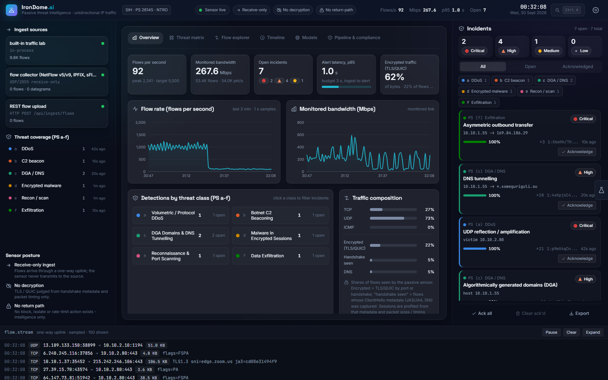

<sub>Live sensor, not a mock-up: incidents from a full kill chain, a UDP amplification attack and SYN floods that the built-in traffic lab injected into a 48-workstation estate.</sub>

</div>

---

## ✨ Highlights

| | |
|:--|:--|
| 🎯 **6 / 6 PS threat classes** | DDoS · C2 beaconing · DGA & DNS tunnelling · malware in encrypted sessions · reconnaissance · data exfiltration, covering **13 attack techniques** mapped to MITRE ATT&CK |
| 📥 **Every input the PS names** | packet captures (PCAP / PCAPNG), **NetFlow v5 / v9, IPFIX** (with RFC 5103 biflows), **sFlow v5** and JSON flow metadata, all on one receive-only UDP collector |
| ✅ **36 / 36 attack runs detected** | 12 attack scenarios × 3 independent replays through the streaming pipeline, scored against ground truth |
| ⚡ **Detects in seconds** | median time-to-detect 1.1 s for scans and DNS tunnels, 1.6 s for DGA, 2 s for floods (C2 beacons take 36 s because they need several check-ins) |
| 🔇 **0 false incidents** | in 15 minutes of benign traffic from a busy 48-workstation estate (109,279 flows); DGA model flags only 1.1% of real popular domains (OpenDNS top 10k) |
| 🚀 **5,000 flows/s per sensor** | 0.00% loss at p95 alert latency 2.34 s in one process, **1.01 s with 4 workers**; with workers the sensor processes 15,000 flows/s without loss |
| 🔒 **Zero return path, zero decryption** | receive-only collector and no mitigation endpoint (both proven by tests), egress denied in Kubernetes; encrypted traffic judged from metadata only |
| 📤 **SOC-ready output** | standard alert schema, syslog/CEF & Kafka to the SIEM, and a hash-chained, HMAC-signed alert archive for forensics |

---

## 🎯 The problem

Critical-infrastructure networks are increasingly monitored through **one-way links (data diodes)**: traffic flows *into* the
monitoring enclave, and nothing can ever flow back. The analysis side can only listen. It cannot complete a handshake,
query the source or block anything inline. Most of that traffic is encrypted, and signature-based tools miss novel attacks.

PS 26145 asks for an AI/ML pipeline that ingests this one-directional traffic (packet captures, NetFlow/IPFIX/sFlow and
derived metadata), **detects, classifies and scores** six classes of threats in near real time, and outputs **labelled
alerts with confidence and supporting evidence**, while keeping ingest read-only, never decrypting payloads, streaming with
bounded latency, meeting a stated throughput target and using a standard alert schema.

## 💡 Our solution

- **One-way ingest, every format.** A receive-only UDP collector decodes JSON biflow records, NetFlow v5, NetFlow v9 and
  IPFIX (template caching per exporter, RFC 5103 reverse fields), and sFlow v5 (sampled packet headers rebuilt into flows
  and scaled by the sampling rate). PCAP/PCAPNG captures are parsed read-only and replayed through the same one-way path.
- **Streaming feature engine.** Seven detectors compute 124 behavioural features in event-time windows with watermarks
  and a late-data policy. Flows are processed as they arrive; nothing waits for a batch.
- **Calibrated, guarded ML.** One model per detector, thresholds inside a 0.5% false-positive budget, plus evidence
  guards: a technique must be physically supported by the evidence; a scan is never reported as a SYN flood; browser
  bursts are never beacons; dictionary-word DGAs are caught through NXDOMAIN behaviour.
- **Real-world grounding.** The DGA model's benign side is trained on the real Tranco top-sites list and validated on
  held-out real domains. JA3 threat intelligence comes from abuse.ch's public SSL Blacklist. Every site can re-calibrate
  thresholds on its own captures.
- **Scales out.** `IRONDOME_WORKERS=N` spreads detection over N processes, partitioned by protected host, with one shared
  estate-context store.
- **Standard, explainable alerts** with Community ID flow identifiers, confidence, severity, MITRE ATT&CK IDs and the
  features that deviate most from the benign baseline, correlated into incidents and sent to the dashboard, SIEM
  (syslog/CEF, Kafka) and a signed archive.
- **SOC dashboard** for live and replayed detections, and a **traffic lab** that generates the PS's "simulated IP data"
  with ground truth.

---

## 🏗️ How it works

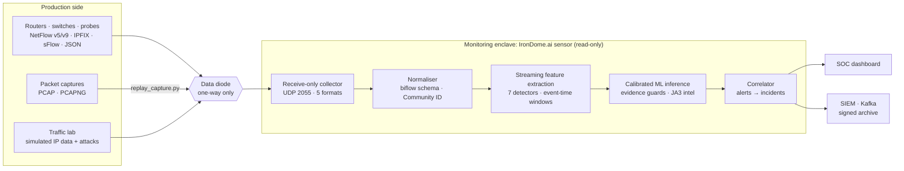

1. **Ingest.** A datagram arrives on UDP 2055 and is decoded by format. The collector never replies; it does not even keep a
   handle it could send with.
2. **Normalise.** Each record becomes a bidirectional flow ("biflow", modelled on IPFIX RFC 5103) with a Community ID v1
   hash, so alerts can be joined with Zeek or Suricata logs.
3. **Extract.** All seven extractors receive the record. Windows close when the event-time watermark passes them (1 s live
   lag). Records older than the 30 s late horizon only update estate context (destination and JA3 prevalence, host
   baselines), so a backlog can never fake a spike.
4. **Infer.** Each window is scored by its calibrated model and must also pass the evidence guards. Prevalence-based detectors
   alert only on overwhelming evidence during a 5-minute baseline-learning period (the live sensor warm-starts from history).
5. **Output.** The alert is built to the standard schema, correlated into an incident (90 s window), archived, and sent to
   the dashboard and SIEM. p95 latency from last contributing flow to alert is typically 1–3 s at demo load (exfiltration
   windows are evaluated every 5 s) and 2.34 s at 5,000 flows/s.

The full design, including the ML lifecycle and data contracts, is in [`ARCHITECTURE.md`](ARCHITECTURE.md).

---

## ✅ Problem-statement compliance

### Expected outcomes

| | PS asks for | IronDome.ai delivers | Where |
|:-:|---|---|---|
| ✅ | Working prototype: ingest, feature extraction, model inference, alert output | Streaming sensor with all four stages, running live or on replayed captures, single-process or scaled out | [`backend/sensor-service/`](backend/sensor-service/), [`irondome/`](irondome/) |
| ✅ | Documentation of models, features, training and validation | Model cards (algorithm, features, importance, calibration), held-out, shifted-distribution and real-domain results, end-to-end evaluation | [`docs/MODEL_REPORT.md`](docs/MODEL_REPORT.md), [`docs/EVAL_REPORT.md`](docs/EVAL_REPORT.md), [`ARCHITECTURE.md`](ARCHITECTURE.md) |
| ✅ | Dashboard of live or replayed detections with severity and confidence | React SOC dashboard: incidents, threat matrix, flow explorer, timeline, models, compliance | [`frontend/`](frontend/) |

### Inputs named in the PS

| | Input | Status | Detectors it can feed |
|:-:|---|---|---|
| ✅ | Packet captures (PCAP / PCAPNG; Ethernet, SLL/SLL2, raw IP, VLAN, IPv4/IPv6) | replay with `scripts/replay_capture.py` | all six classes (DNS, TLS JA3/JA3S/JA4, QUIC extracted from the packets) |
| ✅ | NetFlow v5 · NetFlow v9 · IPFIX | decoded natively; templates cached per exporter; RFC 5103 biflows | (a) DDoS, (b) C2 beaconing, (e) recon, (f) exfiltration |
| ✅ | sFlow v5 | sampled headers rebuilt into flows, counts scaled by the sampling rate | (a), (e), (f); (b), (c), (d) degrade with sampling |
| ✅ | Derived metadata (JSON biflow records from a probe) | UDP or `POST /api/ingest/flows` | all six classes |

### Threat classes

| | PS class | Techniques detected | Key signals |
|:-:|---|---|---|
| ✅ | **(a)** Volumetric / protocol DDoS | SYN flood · UDP/ICMP flood · UDP reflection/amplification · spoofed-source flood · Slowloris | flow and packet rates, **source-IP entropy**, half-open ratio, unanswered ratio, amplification-port share, slow connections per source |
| ✅ | **(b)** Botnet C2 beaconing | periodic beacon (with jitter) | **inter-arrival periodicity** (CV, MAD, regularity), payload-size stability, destination prevalence |
| ✅ | **(c)** DGA domains & DNS tunnelling | DGA · DNS tunnelling | **character entropy, bigram language model**, dictionary coverage and suffix rarity learned from real domains, **NXDOMAIN behaviour**; **query length**, uniqueness, **record-type anomalies**, response size |
| ✅ | **(d)** Malware in encrypted sessions | watch-listed TLS fingerprint · anomalous TLS behaviour | **JA3 / JA3S / JA4** (abuse.ch SSLBL feed), fingerprint and destination prevalence, SNI/ALPN, **packet-size and timing sequences**. Never decrypted |
| ✅ | **(e)** Reconnaissance & port scanning | vertical port scan · horizontal host sweep | **fan-out** (ports per host, hosts per port), failed and no-payload ratios, port contiguity |
| ✅ | **(f)** Data exfiltration | asymmetric outbound transfer | **out/in byte ratio**, volume vs the host's own baseline, destination prevalence, port class |

### Constraints

| | PS constraint | How it is met | Proof |
|:-:|---|---|---|
| ✅ | **(a)** Read-only ingest, no return path, live query or inline block | Receive-only collector that never holds a send handle; no block, isolate or rate-limit endpoint; Kubernetes NetworkPolicy denies all sensor egress; SIEM outputs stay inside the enclave | [`tests/test_sensor_readonly.py`](tests/test_sensor_readonly.py), [`k8s/network-policy.yaml`](k8s/network-policy.yaml) |
| ✅ | **(b)** No payload decryption | The flow schema has no payload field. TLS/QUIC are judged from handshake metadata and packet-size/timing sequences | [`irondome/schema.py`](irondome/schema.py), [`irondome/tls.py`](irondome/tls.py) |
| ✅ | **(c)** Streaming with bounded latency | Event-time windows (2–60 s), watermarks, late-data policy, load shedding; p95 alert latency 2.34 s at 5,000 flows/s (1.01 s with workers) | [`irondome/features.py`](irondome/features.py), [`docs/THROUGHPUT.md`](docs/THROUGHPUT.md) |
| ✅ | **(d)** Defined, demonstrated throughput target | **5,000 flow records/s per sensor**, 0.00% loss, measured over the one-way UDP path by a reproducible benchmark | [`scripts/benchmark_throughput.py`](scripts/benchmark_throughput.py), [`docs/THROUGHPUT.md`](docs/THROUGHPUT.md) |
| ✅ | **(e)** Standard alert schema: timestamp, flow ID, class, confidence, evidence | JSON Schema at `/api/schema/alert`; every alert validated in tests and evaluation (0 schema errors); also exported as CEF | [Alert format](#-standard-alert-record), [`irondome/schema.py`](irondome/schema.py) |

### Dataset guidance

The traffic lab emulates the traffic of every source the PS recommends, and real captures made with those tools replay directly.

| PS-suggested source | Traffic-lab equivalent |
|---|---|
| iperf3 / Ostinato / TRex benign traffic | 48-workstation estate with browser-accurate TLS fingerprints (Chrome, Firefox, Safari, Windows Schannel), DNS, NTP, QUIC, video calls, backups, downloads, P2P, telemetry; web, DNS and NTP servers with client populations and flash crowds |
| hping3 SYN / UDP floods | SYN flood, spoofed-source flood (`--rand-source`), UDP/ICMP flood |
| Reflection / amplification | DNS, NTP, SSDP, memcached, CLDAP, CharGEN and SNMP reflectors |
| Slowloris | many half-sent HTTP requests trickling headers |
| dnscat2 / iodine | dnscat2-style hex, iodine-style base32 over NULL/TXT, slow base32 exfiltration in A lookups |
| DGArchive DGAs | nine generic DGA shapes: random, alphanumeric, hex, pronounceable, consonant-vowel with *y*, syllable chains, dictionary words, word + digits, names under dynamic-DNS providers |
| Sandboxed C2 emulator | jittered TLS beacons and implants with their own TLS stacks (Go, Python, minimal and legacy-SSL clients) |
| (scanning, exfiltration) | nmap-style vertical and horizontal SYN scans; scripted bulk uploads to never-seen destinations |

---

## 📊 Results

> Attack traffic is synthetic (the traffic lab, per the PS's dataset guidance); benign DGA domains are real. Every figure
> reproduces with one command ([see below](#-ml-pipeline--validation)). Deployments re-calibrate on their own captures.

### Model validation: data the models never saw

**Test** has the training distribution. **Stress** is deliberately shifted, with weaker, slower and stealthier attacks and
harder benign look-alikes.

| PS | Detector | Precision | Recall | F1 | False-positive rate | Stress recall |
|:-:|---|:-:|:-:|:-:|:-:|:-:|
| (a) | Volumetric / protocol DDoS | 99.3% | 99.9% | 0.996 | 1.1% | 94.0% |
| (b) | C2 beaconing | 99.6% | 99.3% | 0.995 | 0.1% | 97.4% |
| (c) | DGA domains (per domain, lexical only) | 98.6% | 76.8% | 0.863 | 0.4% | 64.5% |
| (c) | DNS tunnelling | 100% | 100% | 1.000 | 0.0% | 100% |
| (d) | Encrypted-session malware | 99.8% | 99.7% | 0.997 | 0.1% | 97.7% |
| (e) | Recon / port scanning | 100% | 100% | 1.000 | 0.0% | 99.7% |
| (f) | Data exfiltration | 99.8% | 95.0% | 0.974 | 0.1% | 96.5% |

**DGA on real domains.** Judged one domain at a time, dictionary-word DGAs look like real brand names, which is why lexical
recall is 77%. At host level the sensor adds NXDOMAIN behaviour and detects **all nine DGA shapes, 3/3 each**. False
positives on real popular domains the model never trained on:

| Real benign list | Domains | Flagged |
|---|:-:|:-:|
| Tranco top-100k, held-out test partition | 11,368 | **0.4%** |
| OpenDNS top 10k (all) | 10,000 | **1.1%** |
| OpenDNS top 10k, domains outside the training partition | 3,010 | **1.2%** |

Several of the highest-scoring "benign" domains in these popularity lists (e.g. `qugylddujwj.biz`) look algorithmically
generated themselves; popularity lists are known to contain sinkholed malware domains. Recall on real DGA families is
measured with `model_microservice/evaluate_domains.py --dga <labelled list>`. Full per-family numbers:
[`docs/MODEL_REPORT.md`](docs/MODEL_REPORT.md).

### End-to-end detection: the full streaming pipeline against ground truth

Each run is a benign estate with one attack injected after a 5-minute warm-up, replayed through the code the live sensor runs.

| PS | Scenario | Emulates | Detected | Median time-to-detect | Off-target incidents |
|:-:|---|---|:-:|:-:|:-:|
| (a) | SYN flood | `hping3 -S --flood` | 3 / 3 | 2.0 s | 0 |
| (a) | Spoofed-source flood | `hping3 -S --rand-source` | 3 / 3 | 2.0 s | 0 |
| (a) | UDP flood | `hping3 --udp --flood` | 3 / 3 | 2.0 s | 0 |
| (a) | UDP amplification | reflector set | 3 / 3 | 2.0 s | 0 |
| (a) | Slowloris | `slowloris` | 3 / 3 | 12.0 s | 0 |
| (b) | C2 beaconing | sandboxed C2 emulator | 3 / 3 | 36.0 s | 0 |
| (c) | DGA (all nine shapes) | DGArchive-style generator | 3 / 3 | 1.6 s | 0 |
| (c) | DNS tunnel | dnscat2 / iodine | 3 / 3 | 1.1 s | 0 |
| (d) | Malware over TLS | implant TLS stack | 3 / 3 | 3.2 s | 0 |
| (e) | Port scan | `nmap -sS -p1-1024` | 3 / 3 | 1.1 s | 0 |
| (e) | Host sweep | `nmap -sS -p445,3389` | 3 / 3 | 1.4 s | 1 per run (same scanner, reported after the scoring window) |
| (f) | Exfiltration | scripted upload | 3 / 3 | 10.0 s | 0 |

**False positives:** 15 minutes of benign-only traffic (109,279 flows) produced **0 false incidents**. Details:
[`docs/EVAL_REPORT.md`](docs/EVAL_REPORT.md).

### Throughput and latency (PS constraint d)

Flow records exported one-way over UDP in MTU-sized datagrams, sender and sensor on one Windows 11 machine:

| Offered load | 1 process: loss · p95 latency | 4 workers: loss · p95 latency |
|:-:|:-:|:-:|
| 2,500 flows/s | 0.00% · 0.97 s | – |
| **5,000 flows/s** | **0.00% · 2.34 s** | **0.00% · 1.01 s** |
| 7,500 flows/s | 67% (saturated) | 0.00% · 5.0 s |
| 15,000 flows/s | – | 0.00% · 3.9 s |

**Stated target: 5,000 flow records per second per sensor within a 3 s p95 alert-latency budget.** With workers the sensor
keeps up with 15,000 flows/s without loss; latency then exceeds the budget because partitioning by protected host puts
all traffic aimed at one very busy host (the flood victim) on one worker. Details: [`docs/THROUGHPUT.md`](docs/THROUGHPUT.md).

---

## 🚨 Standard alert record

Every detection is emitted in one schema (PS constraint e): `GET /api/schema/alert`, the dashboard's *Pipeline & compliance*
tab, or CEF over syslog.

| Field | Meaning |
|---|---|
| `timestamp` · `first_seen` · `last_seen` | when the alert was raised, and the event-time span of the evidence |
| `flow_id` · `related_flow_ids` | **Community ID v1** of the representative and contributing flows |
| `flow` · `entity` | representative 5-tuple, and what the detector aggregated over (victim, source, host pair, host + domain, flow) |
| `threat_class` · `ps_ref` · `technique` · `mitre_attack` | PS class (a–f), technique and ATT&CK IDs |
| `confidence` · `severity` | calibrated probability (0–1); severity from the class's base severity and the confidence |
| `evidence` | feature values, the **features furthest from the benign baseline** (z-scores) and detector context (top talkers, sample queries, fingerprints, which intel list matched) |
| `detector` · `source` · `occurrences` · `latency_ms` · `recommended_action` | model, mode and threshold; live or replay; correlated sightings; processing latency; out-of-band guidance |

<details>
<summary><b>Example: a live DNS-tunnelling alert</b> (trimmed)</summary>

```json
{
  "schema_version": "1.0",
  "alert_id": "b795e6da-6bd7-4af4-9ce0-a78829a1a2fb",
  "timestamp": "2026-09-29T15:56:04.032Z",
  "first_seen": "2026-09-29T15:56:02.005Z",
  "last_seen": "2026-09-29T15:56:52.665Z",
  "flow_id": "1:Ybzva0TVg5VuthBf4iZhobcImug=",
  "flow": { "src_ip": "10.10.1.16", "src_port": 49062, "dst_ip": "203.0.113.53", "dst_port": 53, "protocol": "UDP" },
  "entity": { "type": "host_domain", "ip": "10.10.1.16", "domain": "haseponutomojalih.top" },
  "threat_class": "dga_dns_tunnelling",
  "ps_ref": "c",
  "technique": "dns_tunnelling",
  "mitre_attack": ["T1071.004", "T1572"],
  "confidence": 1.0,
  "severity": "high",
  "description": "DNS tunnelling 10.10.1.16 -> haseponutomojalih.top: 22 encoded queries, mean subdomain 75 chars, 100% unique.",
  "recommended_action": "Report the queried base domain to the DNS / resolver team for sinkholing via the production-side change process, and open an endpoint investigation on the host.",
  "detector": { "name": "dns_tunnel", "model": "DNS tunnelling classifier", "version": "2.0", "mode": "ml", "threshold": 0.51 },
  "evidence": {
    "features": { "queries": 22.0, "unique_ratio": 1.0, "mean_sub_len": 75.68, "sub_entropy_mean": 3.95, "txt_null_ratio": 1.0 },
    "top_deviations": [
      { "feature": "max_qname_len", "value": 139.0, "benign_mean": 37.86, "z_score": 6.86 },
      { "feature": "query_rate", "value": 7.736, "benign_mean": 1.23, "z_score": 6.66 }
    ],
    "context": {
      "base_domain": "haseponutomojalih.top",
      "sample_queries": ["026ac3e2b21b71344a5e01fbd69025cb1e4469044ee77857bbc7936d278a16c.9d3d54.t.haseponutomojalih.top"],
      "qtypes": { "CNAME": 5, "TXT": 7, "MX": 10 }
    }
  },
  "occurrences": 25,
  "source": { "pipeline": "sensor", "mode": "live" },
  "latency_ms": 97.5
}
```

The same alert as a SIEM receives it (syslog RFC 5424 + CEF):

```
<131>1 2026-09-29T15:56:04.032Z sensor01 irondome - dga_dns_tunnelling - CEF:0|IronDome.ai|Passive Sensor|2.0|dga_dns_tunnelling:dns_tunnelling|DNS tunnelling|8|rt=1790697364032 src=10.10.1.16 spt=49062 dst=203.0.113.53 dpt=53 proto=UDP cat=dga_dns_tunnelling cs1Label=technique cs1=dns_tunnelling cs2Label=flowId cs2=1:Ybzva0TVg5VuthBf4iZhobcImug\= cs3Label=psRef cs3=c cs4Label=mitre cs4=T1071.004,T1572 cfp1Label=confidence cfp1=1.0 cnt=25 externalId=b795e6da-6bd7-4af4-9ce0-a78829a1a2fb msg=DNS tunnelling 10.10.1.16 -> haseponutomojalih.top: 22 encoded queries, mean subdomain 75 chars, 100% unique.
```

</details>

---

## 🖥️ Dashboard

<table>
  <tr>
    <td width="50%">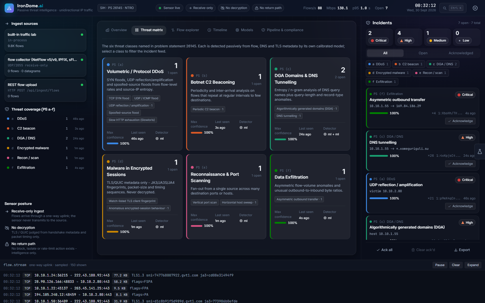<br><b>Threat matrix</b>: the six PS classes with techniques, counts and confidence</td>
    <td width="50%">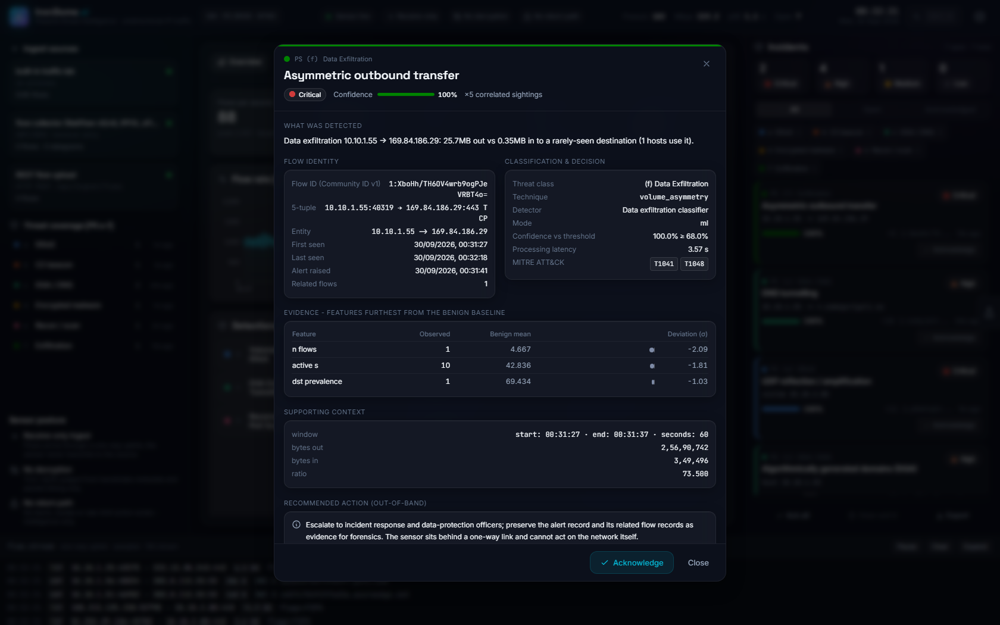<br><b>Incident forensics</b>: Community ID, decision vs threshold, evidence vs benign baseline, ATT&amp;CK</td>
  </tr>
  <tr>
    <td>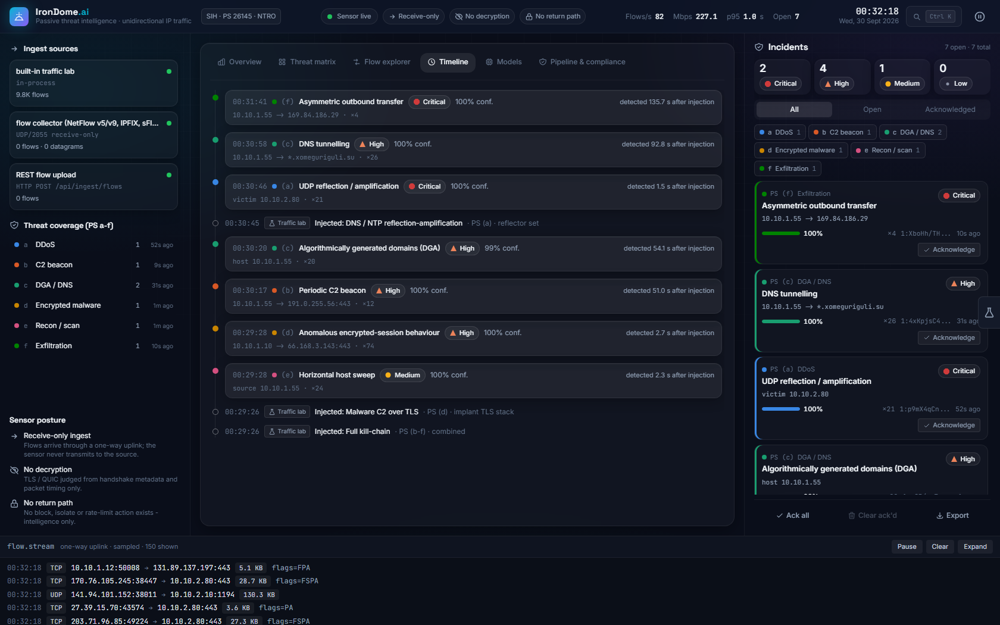<br><b>Timeline</b>: a kill chain unfolding (scan → beacon → DGA → tunnel → exfiltration), with time from injection to detection</td>
    <td>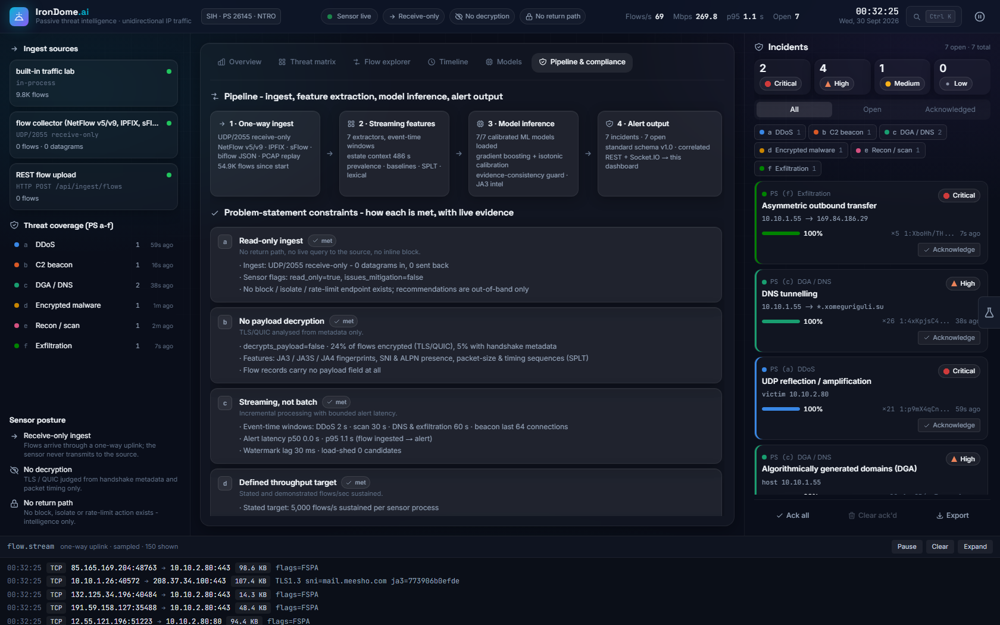<br><b>Pipeline &amp; compliance</b>: each PS constraint with live evidence from the running sensor</td>
  </tr>
  <tr>
    <td>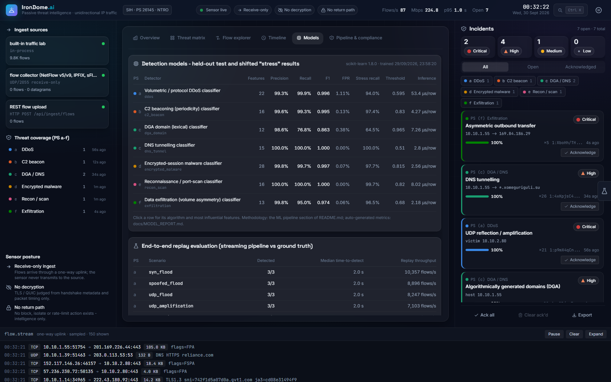<br><b>Models</b>: held-out and stress metrics for every detector, plus end-to-end replay results</td>
    <td>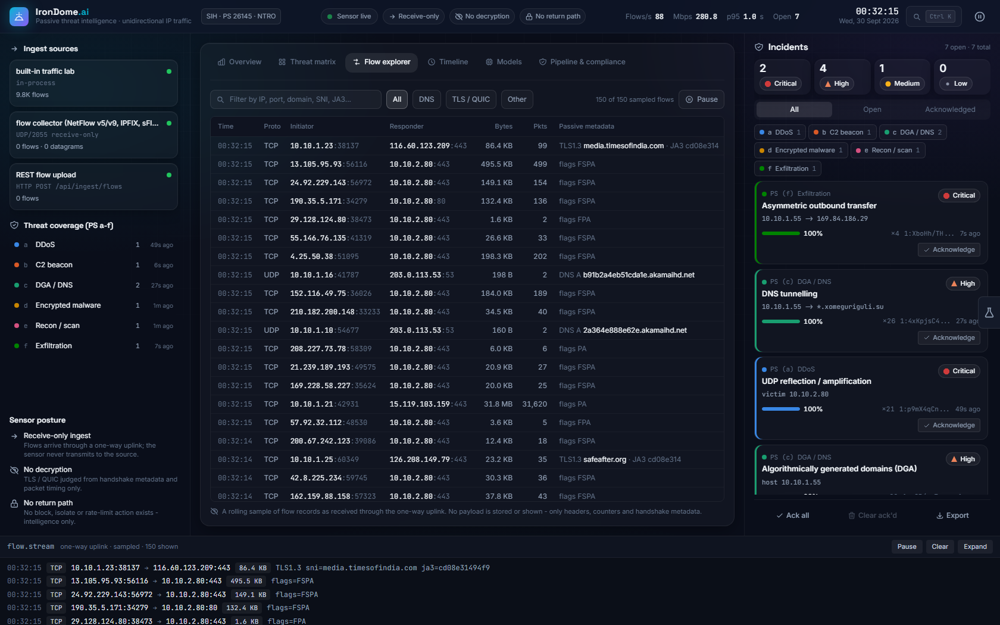<br><b>Flow explorer</b>: the one-way flow stream with DNS, TLS and JA3 metadata; no payload is ever stored or shown</td>
  </tr>
  <tr>
    <td colspan="2">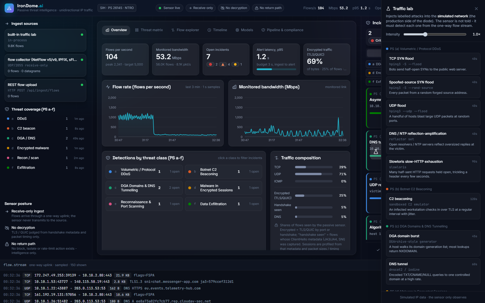<br><b>Traffic lab</b>: inject any PS attack into the simulated production network. The sensor is not told and has to find it from the flow stream</td>
  </tr>
</table>

Also included: incident filters (severity, class, status), acknowledge, JSONL export and per-alert JSON download; ingest
counters per input format; encrypted-traffic share by port and by captured handshake; a command palette
(<kbd>Ctrl</kbd>+<kbd>K</kbd>); a colour-blind-safe palette with icon + label on every status; and a **demo mode** without backend.

---

## 🚀 Quick start

**Prerequisites:** Python 3.11+, Node.js 18+ (20 recommended) and Git; or just Docker.

```bash
# Option A - Docker (sensor + dashboard)
git clone https://github.com/Jyotier2006/IronDome.ai.git && cd IronDome.ai
docker compose up --build          # dashboard http://localhost:8080 · API :3001 · flow collector udp :2055
```

```bat
:: Option B - Windows, native
git clone https://github.com/Jyotier2006/IronDome.ai.git
cd IronDome.ai
setup.bat     :: one time: venv, Python + Node dependencies, unit tests
START.bat     :: sensor + dashboard -> http://localhost:5173
```

```bash
# Option C - Linux / macOS, native
git clone https://github.com/Jyotier2006/IronDome.ai.git && cd IronDome.ai
python3 -m venv venv && source venv/bin/activate
pip install -r backend/sensor-service/requirements.txt -r model_microservice/requirements.txt
npm install && npm run dev          # sensor (API :3001, UDP :2055) + dashboard (:5173)
```

The sensor warm-starts with 5 minutes of estate history, streams the built-in traffic lab and injects a random attack every
~2 minutes. **Just the UI?** `npm run demo` runs the dashboard on built-in sample data.

<details>
<summary><b>Sensor configuration</b> (environment variables)</summary>

| Variable | Default | Meaning |
|---|---|---|
| `PORT` · `IRONDOME_UDP_PORT` | `3001` · `2055` | API / Socket.IO and the receive-only flow collector |
| `IRONDOME_LAB` · `IRONDOME_AUTO_SCENARIOS` · `IRONDOME_SCALE` | `on` · `on` · `1.0` | built-in traffic lab, automatic attacks, background volume |
| `IRONDOME_WARM_START` | `300` | seconds of estate history loaded at start-up |
| `IRONDOME_INTERNAL_CIDRS` | RFC 1918 | the protected address space |
| `IRONDOME_WORKERS` | `0` | detection worker processes (scale-out) |
| `IRONDOME_LAB_JA3` | `on` | the lab's simulated JA3 list; `off` on a real network (abuse.ch SSLBL stays on) |
| `IRONDOME_SYSLOG` · `IRONDOME_SYSLOG_FORMAT` | – · `cef` | `udp://host:514` or `tcp://host:6514`, CEF or JSON |
| `IRONDOME_KAFKA` · `IRONDOME_KAFKA_TOPIC` | – · `irondome.alerts` | Kafka output (needs `kafka-python`) |
| `IRONDOME_ARCHIVE_DIR` · `IRONDOME_ARCHIVE_KEY` | – | hash-chained, HMAC-signed alert archive |

</details>

<details>
<summary><b>API reference</b> (all read-only except the two inbound POSTs)</summary>

| Endpoint | Purpose |
|---|---|
| `GET /health` | liveness, `read_only: true`, `issues_mitigation: false`, scale-out and output status |
| `GET /api/alerts` · `GET /api/alerts/{id}` | correlated incidents (filter with `threat_class`) |
| `GET /api/stats` · `GET /api/flows/recent` · `GET /api/sources` | counters, latency, sampled flows, per-format ingest counts |
| `GET /api/schema/alert` | the alert JSON Schema |
| `GET /api/models` · `GET /api/evaluation` · `GET /api/features` · `GET /api/threat-classes` · `GET /api/scenarios` | model cards, evaluation, catalogues |
| `POST /api/ingest/flows` | upload flow records (data in only) |
| `POST /api/scenario` | inject a traffic-lab scenario (drives the simulated source, not the sensor) |

Socket.IO events: `hello`, `incidents_snapshot`, `flows_snapshot`, `alert`, `alert_update`, `flow_stats`, `flows_batch`, `scenario`.

</details>

---

## 🎬 Demo guide (for evaluators)

1. **Launch** with `docker compose up` (dashboard on :8080) or `START.bat` (:5173). Live flows appear in the stream at the bottom.
2. **Inject an attack.** Open the traffic lab (flask tab on the right edge, or <kbd>Ctrl</kbd>+<kbd>K</kbd> → *Open traffic lab*) and
   pick **Full kill-chain** or **TCP SYN flood**. The sensor is not told what was injected.
3. **Watch it being detected.** Incidents appear within seconds; the *Timeline* shows injection-to-detection time.
4. **Open an incident** for the Community ID, the decision against the threshold, the features that gave it away and the
   recommended out-of-band action.
5. **Replay a capture in any export format** (the file's SHA-256 is printed for chain of custody):
   ```bash
   python scripts/replay_capture.py captures/recon_tunnel_tls.jsonl.gz                      # JSON metadata: all classes
   python scripts/replay_capture.py captures/kill_chain.jsonl.gz --format ipfix             # as an IPFIX exporter
   python scripts/replay_capture.py my.pcapng --format sflow --sampling 64                  # as an sFlow agent
   ```
6. **Check compliance.** The *Pipeline & compliance* tab shows each PS constraint with live evidence.

## 📥 Connecting real traffic

| Source | How |
|---|---|
| **Packet captures** (tcpdump, Wireshark, captures of hping3, nmap, dnscat2, iodine…) | `python scripts/replay_capture.py capture.pcapng` (optionally `--format ipfix/netflow9/netflow5/sflow`) |
| **NetFlow v5 / v9, IPFIX exporters** (routers, softflowd, nProbe, YAF) | point the exporter at `<sensor>:2055/udp` |
| **sFlow agents** (switches) | point the agent at `<sensor>:2055/udp`; counts are scaled by the advertised sampling rate |
| **Flow metadata** from your own probe | JSON biflow records to UDP 2055, or `POST /api/ingest/flows` |
| **Synthetic stream** from another machine | `python scripts/traffic_lab.py stream --sensor <ip>:2055 --auto [--format ipfix]` |
| **Your own labelled captures** | `python scripts/traffic_lab.py capture --scenario syn_flood --out x.jsonl.gz --pcap x.pcap` (flows, Wireshark PCAP and ground truth) |

---

## 🔬 ML pipeline & validation

| Step | What we do |
|---|---|
| **Data** | Labelled windows from the traffic lab, extracted by **the same streaming code the sensor runs**. Benign DGA domains come from the **real Tranco top-sites list**, hash-partitioned so no domain is in both training and test |
| **Splits** | Four disjoint, independently seeded sets per detector: train, validation, test (same distribution) and **stress** (shifted, never seen) |
| **Hard negatives** | Flash crowds, scan noise at servers, NTP/QUIC/VoIP bursts, CDN and telemetry DNS, cloud backups, video calls, retrying clients, keep-alive web traffic |
| **Model** | `HistGradientBoostingClassifier` (class-balanced, early stopping) + **isotonic calibration**; multi-class for DDoS and recon techniques |
| **Threshold** | best F1 on validation **within a 0.5% false-positive budget** |
| **Guards** | evidence consistency (technique must match the evidence), scan-vs-flood attribution, sub-second "beacons" rejected, Slowloris needs repeat sources, baseline-learning period with warm start, two-signal gate for encrypted traffic, NXDOMAIN behaviour for dictionary DGAs |
| **Explainability** | permutation importance per model; every alert lists its most anomalous features with z-scores against the benign baseline |
| **Threat intel** | abuse.ch SSLBL JA3 feed (97 real malware fingerprints; `scripts/update_threat_intel.py`); the lab's own fingerprints are a separate, clearly labelled list |
| **Site re-calibration** | `model_microservice/recalibrate.py` replays captures from the protected network and raises any threshold that would exceed the false-positive budget there (never lowers it); reports recall on labelled attack windows |

```bash
python scripts/fetch_domain_lists.py   # real Tranco / OpenDNS benign domain lists (once)
npm run train                          # train + validate all 7 models (~1.5 min) -> model_microservice/models/, docs/MODEL_REPORT.md
npm run evaluate                       # end-to-end replay evaluation (~6 min) -> docs/EVAL_REPORT.md
npm test                               # 34 unit tests
python model_microservice/evaluate_domains.py --benign data/opendns_top.txt --dga <your DGA list>
python model_microservice/recalibrate.py --capture site_baseline.pcapng --dry-run
IRONDOME_LAB=off python backend/sensor-service/sensor_service.py &  python scripts/benchmark_throughput.py
```

**Validating against the real tools.** Run hping3, nmap, dnscat2 and iodine against lab targets in an isolated VM, record
with tcpdump, write the attack windows in the `captures/*.truth.json` format, and run
`recalibrate.py --capture redteam.pcapng --truth redteam.truth.json --dry-run` to measure recall on real tool traffic.

---

## 🐳 Deployment (Docker & Kubernetes)

Both images were built and run: the sensor container ran hardened (read-only root filesystem, no capabilities, non-root)
with 2 workers and detected a SYN flood plus a scan arriving as IPFIX from the host. It was then deployed to Docker
Desktop Kubernetes, where all pods came up Ready, detections worked in-cluster and the signed archive verified inside the pod.

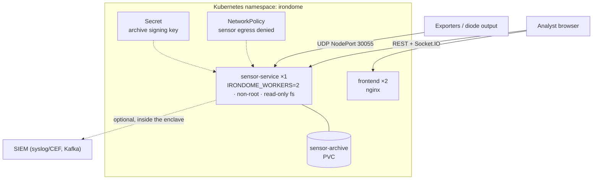

```bash
# Docker Compose: sensor + dashboard, archive volume, hardened sensor container
IRONDOME_ARCHIVE_KEY=$(python -c "import secrets;print(secrets.token_hex(32))") docker compose up --build

# Kubernetes (Docker Desktop, kind or minikube)
bash k8s/build-images.sh && bash k8s/kuber_start.sh
# dashboard http://localhost:8080 · API http://localhost:3001 · flow collector <node-ip>:30055/udp
```

`k8s/build-images.sh` also loads the images into kind-based nodes (Docker Desktop's current Kubernetes). Manifests,
configuration and operations: [`k8s/KUBERNETES.md`](k8s/KUBERNETES.md).

### Scale-out

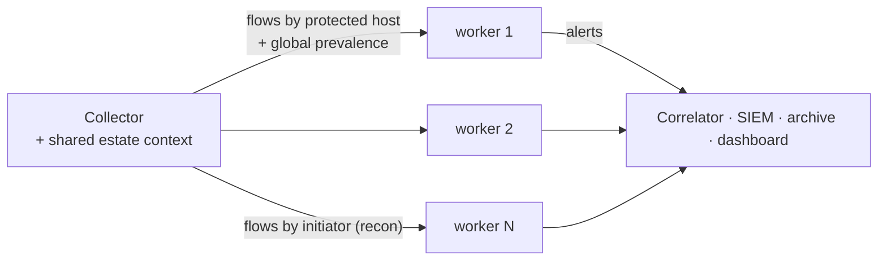

The main process keeps the one estate-context store (prevalence spans all hosts) and attaches it to every routed flow, so
each worker scores exactly as a single process would. Details: [`ARCHITECTURE.md`](ARCHITECTURE.md#3-scale-out-across-processes).

---

## 🔒 Security by design

- **One-way by construction.** The collector never holds a transport handle it could send with; a test fires JSON and
  NetFlow datagrams at it over a real UDP socket and asserts nothing comes back (IPFIX, v9 and sFlow use the same collector).
- **No mitigation surface.** No block, isolate, null-route or rate-limit endpoint exists (tested). Recommended actions are
  advisory text for teams on the production side.
- **Cluster-enforced.** Non-root, read-only root filesystem, no capabilities, no service-account token; a NetworkPolicy
  denies all egress (a commented template allows exactly one SIEM address inside the enclave).
- **Privacy-preserving.** No payload is stored, shown or decrypted.
- **Tamper-evident evidence.** Every alert goes to a SHA-256 hash-chained, HMAC-SHA256-signed archive;
  `scripts/verify_archive.py` pinpoints any edited, deleted or reordered record.
- **Clean evaluation.** Lab ground truth is stripped before export, so the sensor never sees the answers (tested).

## 🧪 Testing

`npm test` runs **34 unit tests**. They cover:

- JA3/JA4 against published reference values, and the Community ID specification vector
- DNS, NetFlow v5, PCAP, IPFIX, NetFlow v9 and sFlow round trips, including decoder fuzzing
- streaming features and the late-data policy
- the evidence guards: scan-vs-flood, beacon and Slowloris
- dynamic-DNS domain splitting and recalibration maths
- alert-schema conformance and correlation
- CEF/syslog delivery, and archive tamper detection
- a real two-worker scale-out run
- the read-only guarantees (live UDP no-reply check, every format through the collector, API-surface check)

## 🧰 Tech stack

| Layer | Technology |
|---|---|
| Core library | Python standard library only: flow schema, PCAP/PCAPNG, NetFlow v5/v9, IPFIX, sFlow, DNS and TLS parsing, JA3/JA4, streaming features, CEF/syslog, signed archive |
| Sensor | FastAPI, python-socketio, Uvicorn (asyncio UDP collector), multiprocessing workers |
| Machine learning | scikit-learn (HistGradientBoosting, isotonic calibration), NumPy, joblib |
| Dashboard | React 18, Vite 5, Tailwind CSS, Recharts, Framer Motion, socket.io-client |
| Operations | Docker, Docker Compose, Kubernetes (namespace, egress-deny NetworkPolicy, PVC, probes) |

## 📁 Repository structure

```
IronDome.ai/
├── irondome/                   # core library (pure standard-library Python)
│   ├── schema.py · features.py · scoring.py · correlate.py      # flow & alert schema, streaming features, inference, incidents
│   ├── netflow.py · ipfix.py · sflow.py · pcap.py · dnsmsg.py    # wire formats: NetFlow v5/v9, IPFIX, sFlow, PCAP, DNS
│   ├── tls.py · lexical.py · lexical_model.json · domains.py     # JA3/JA3S/JA4; DNS lexical model learned from real domains
│   ├── sharding.py · outputs.py · export.py                      # scale-out workers; SIEM + signed archive; one-way exporter
│   └── traffic.py · lab.py · samples.py · netutil.py             # traffic lab, training samples, helpers
├── backend/sensor-service/     # the passive sensor (+ intel/: abuse.ch SSLBL JA3 feed, lab fingerprints)
├── model_microservice/         # training, evaluation, domain evaluation, site re-calibration; trained models
├── frontend/                   # React SOC dashboard
├── scripts/                    # traffic_lab · replay_capture · benchmark_throughput · fetch_domain_lists
│                               # update_threat_intel · verify_archive
├── captures/                   # demo flow captures with ground truth
├── tests/                      # 34 unit tests
├── docs/                       # MODEL_REPORT · EVAL_REPORT · THROUGHPUT (generated) · images
├── k8s/                        # Kubernetes manifests, guide and scripts
├── docker-compose.yml
└── ARCHITECTURE.md
```

## ✔️ Project status

- [x] One-way ingest: UDP collector for JSON biflows, NetFlow v5, NetFlow v9, IPFIX, sFlow v5; PCAP/PCAPNG replay; REST upload
- [x] Streaming feature extraction: 7 detectors, 124 features, watermarks and a late-data policy
- [x] Model inference: 7 calibrated models, evidence guards, abuse.ch JA3 intel, NXDOMAIN behaviour for DGA
- [x] DGA model grounded on real popular domains, with a real-domain false-positive check
- [x] Standard alert output with incident correlation
- [x] SIEM forwarding (syslog/CEF or JSON, Kafka) and a signed, hash-chained alert archive
- [x] Scale-out across worker processes with a shared estate-context store
- [x] Site re-calibration on captures from the protected network
- [x] SOC dashboard for live and replayed detections
- [x] Training, validation and end-to-end evaluation reports
- [x] Throughput benchmark with a stated, demonstrated target
- [x] 34 unit tests, including the read-only guarantees
- [x] Docker images, Docker Compose and Kubernetes manifests, verified by building, running and deploying them

## 💬 For the Q&A

- **Which inputs feed which classes?** NetFlow and IPFIX carry no DNS names or TLS handshakes, so over them alone classes
  (a), (b), (e) and (f) work. (c) and (d) need packet captures or a probe exporting the JSON metadata format. sFlow's
  sampling weakens beaconing and DNS/TLS analysis.
- **How well does it work on real traffic?** Attack training data is synthetic, generated per the PS's dataset guidance; the DGA
  model's benign side is real and validated on held-out real domains. For each deployment: re-calibrate thresholds on
  the site's own benign captures (`recalibrate.py`), and measure recall with captures of the real tools and labelled DGA
  lists (`evaluate_domains.py`).
- **How far does it scale?** 5,000 flows/s per sensor within the 3 s latency budget; with workers, 15,000 flows/s without
  loss but higher latency, because one very busy host is handled by one worker. Scaling across machines would need the
  estate context in a shared store. There is no auto-scaling: the sensor runs as one pod and scales with `IRONDOME_WORKERS`.
- **Is the JA3 intel real?** Yes: abuse.ch SSLBL (97 fingerprints; abuse.ch stopped updating it in 2021). The lab's own
  fingerprints are a separate list, labelled as such in every alert, and switched off with `IRONDOME_LAB_JA3=off`.

## 🙏 Acknowledgements

Problem statement 26145 by the **National Technical Research Organisation (NTRO)** for **Smart India Hackathon**. Built on
open specifications and data: Community ID flow hashing, JA3/JA3S, JA4, IPFIX (RFC 7011, RFC 5103), NetFlow v9
(RFC 3954), sFlow v5, CEF, MITRE ATT&CK, the Tranco and OpenDNS domain lists, and the abuse.ch SSL Blacklist.

<div align="center">

**IronDome.ai: see every threat, touch nothing.**

</div>
