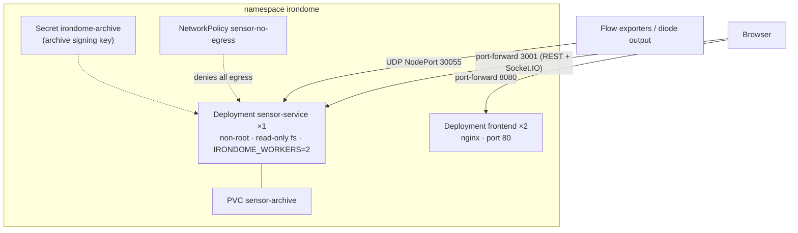

# Running IronDome.ai on Kubernetes

Everything lives in the `irondome` namespace: the passive sensor, the dashboard, an
egress-deny NetworkPolicy and a volume for the signed alert archive. Tested layout for a
local cluster (Docker Desktop, kind or minikube); on a shared cluster, push the images to
your registry and set `imagePullPolicy: IfNotPresent`.



## Quick start

```bash
cd k8s
./build-images.sh     # irondome-sensor, irondome-dashboard, irondome-training
./kuber_start.sh      # namespace, archive key, sensor, policy, dashboard, port-forwards
```

- Dashboard: http://localhost:8080
- Sensor API: http://localhost:3001/health
- Flow collector (UDP): `<node-ip>:30055`, e.g.
  `python scripts/replay_capture.py captures/kill_chain.jsonl.gz --sensor 127.0.0.1:30055 --format ipfix`

## Manifests

| File | Contents |
|---|---|
| `namespace.yaml` | the `irondome` namespace |
| `sensor-service.yaml` | sensor Deployment (1 pod, `IRONDOME_WORKERS=2` inside it), archive PVC, ClusterIP service (3001/tcp, 2055/udp), NodePort 30055/udp for external exporters |
| `network-policy.yaml` | denies all egress from the sensor pod; a commented template allows one SIEM address inside the enclave |
| `frontend.yaml` | dashboard Deployment ×2 and service |
| `ingress.yaml` | optional single-host ingress (`irondome.local`): `/` → dashboard, `/api` + `/socket.io` → sensor |

The sensor pod runs as UID 65534 with a read-only root filesystem, no capabilities, no
service-account token and no privilege escalation. Its only writable paths are `/tmp`
(emptyDir) and the archive volume.

## Configuration

Edit the `env` block in `sensor-service.yaml`:

| Variable | Default here | Meaning |
|---|---|---|
| `IRONDOME_LAB` | `on` | built-in traffic lab; `off` for real exporters only |
| `IRONDOME_LAB_JA3` | `on` | the lab's simulated JA3 list; set `off` on a real network (the public abuse.ch SSLBL list stays active) |
| `IRONDOME_WORKERS` | `2` | detection worker processes (raise with the pod's CPU limit) |
| `IRONDOME_INTERNAL_CIDRS` | RFC 1918 | the protected address space |
| `IRONDOME_ARCHIVE_DIR` / `IRONDOME_ARCHIVE_KEY` | volume / Secret | signed archive; `deploy-k8s.sh` creates the key once |
| `IRONDOME_SYSLOG` | unset | `udp://host:514` or `tcp://host:6514`, CEF or JSON (`IRONDOME_SYSLOG_FORMAT`) |
| `IRONDOME_KAFKA` / `IRONDOME_KAFKA_TOPIC` | unset | Kafka brokers and topic (needs `kafka-python` in the image) |

If you enable a SIEM output, also add its address to `network-policy.yaml`. It must be
inside the enclave, never on the production side.

## Operations

```bash
./status.sh                         # deployments, pods, services, policies
./logs.sh sensor-service 100        # sensor logs
./restart.sh sensor-service         # rolling restart
./scale.sh frontend 3               # the dashboard scales freely; the sensor scales with IRONDOME_WORKERS
./stop.sh                           # scale to zero, stop port-forwards
./cleanup.sh                        # delete the namespace (archive volume included)
```

Verify the archive from inside the pod (the key is already in the pod's environment):

```bash
kubectl -n irondome exec deploy/sensor-service -- python /app/scripts/verify_archive.py /var/lib/irondome/archive
```

## Notes

- NetworkPolicy is enforced only by CNIs that implement it (Calico, Cilium, ...). Docker
  Desktop's default network accepts the object but does not enforce it.
- The sensor runs as one pod. More throughput comes from `IRONDOME_WORKERS` and more CPU,
  not from more replicas, because the estate context lives in the pod's main process.
